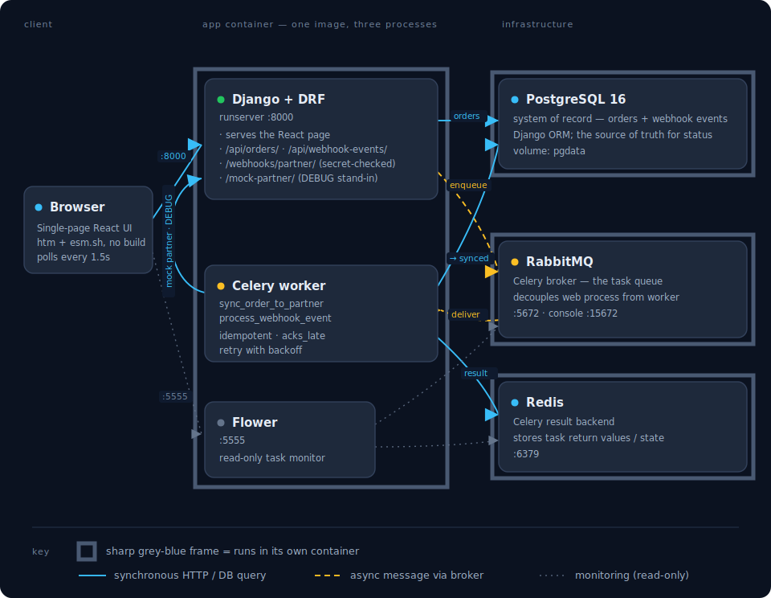

# platform-service

A small demo Django platform slice — **REST APIs, background jobs, and a
third-party integration** — proving out a Django / DRF / Celery / PostgreSQL /
RabbitMQ stack. Everything (app + tooling + infrastructure) runs in containers
via rootless **podman-compose**, so the host stays clean.

## Architecture

<p align="center">
  
</p>

A single pod of four containers:

| Container | Image | Role |
|---|---|---|
| `app` | built from `Containerfile` (Python 3.12 + uv) | your code + all tooling; idles, you exec in |
| `postgres` | postgres:16 | database |
| `rabbitmq` | rabbitmq:3-management | Celery broker |
| `redis` | redis:7 | Celery result backend |

Your working tree is bind-mounted into `app` at `/workspace`, so edits on the
host are live inside the container. The virtualenv lives in a named volume at
`/opt/venv`, off the host tree.

### How a request flows

Two paths run through the same stack: a synchronous request path, and an
asynchronous background path that the broker decouples from the web process.

**Order sync** — create an order and watch its badge flip `pending → synced`:

1. Browser `POST`s to `/api/orders/`; the DRF serializer validates `total_amount > 0`.
2. `create_order()` saves the order as **pending** in PostgreSQL.
3. On `transaction.on_commit`, `sync_order_to_partner.delay(id)` publishes a task
   to RabbitMQ — passing the *id*, never the ORM object.
4. The Celery worker consumes it, re-loads the order by id (idempotent), and
   `POST`s it through `PartnerClient`.
5. In DEBUG the "partner" is Django's own `/mock-partner/` endpoint, so the call
   succeeds locally.
6. The worker sets the order to **synced** in PostgreSQL and stores the task
   result in Redis. On failure it retries with backoff, then **failed**.
7. The polling React UI reflects the new status within ~1.5s.

**Webhook processing** — send a partner webhook and watch the event flip
`pending → processed`:

1. Caller `POST`s to `/webhooks/partner/` with an `X-Partner-Secret` header.
2. Django compares the secret with `hmac.compare_digest`; a mismatch returns
   `401` and stores nothing.
3. The payload is persisted as a `WebhookEvent` (unprocessed); the request
   returns `202` immediately — no slow work in the handler.
4. On commit, `process_webhook_event.delay(id)` enqueues to RabbitMQ.
5. The worker picks it up and marks the event **processed**.
6. The events panel (reading `/api/webhook-events/`) shows the transition.

## Prerequisites

- **podman** (rootless) and **podman-compose** (`uv tool install podman-compose`)
- That's it — Python, uv, Django, and every other tool live inside the `app` container.

## Quickstart

```bash
cp .env.example .env   # first checkout only (.env is git-ignored)
make build             # build the app image
make up                # start all four containers
make migrate           # apply migrations to Postgres
make superuser         # (optional) create an admin login
make run               # Django dev server on :8000
```

In separate terminals, for the async parts:

```bash
make worker         # Celery worker (consumes from RabbitMQ)
make flower         # task monitor on :5555
```

Then open **http://localhost:8000/** for the hands-on UI: create an order and
watch it flip `pending → synced` as the worker syncs it to the local mock
partner, and send partner webhooks and watch them flip `pending → processed`
in the events panel. (The UI is a single Django-served page that loads React
from a CDN — no build step; it needs browser internet access.)

Then try the API with `api.http` (VS Code REST Client) or `curl`:

```bash
curl -s localhost:8000/health/
curl -s -X POST localhost:8000/api/orders/ \
  -H 'Content-Type: application/json' \
  -d '{"customer_name": "Ada", "total_amount": "42.50"}'
```

## URLs

| URL | What |
|---|---|
| http://localhost:8000/ | **Hands-on UI** — create orders, watch them sync, send webhooks |
| http://localhost:8000/api/orders/ | Orders REST API |
| http://localhost:8000/api/webhook-events/ | Received webhook events (read-only) |
| http://localhost:8000/webhooks/partner/ | Partner webhook receiver |
| http://localhost:8000/health/ | Health check (DB round-trip) |
| http://localhost:8000/admin/ | Django admin (needs `make superuser`) |
| http://localhost:15672 | RabbitMQ management UI (guest/guest) |
| http://localhost:5555 | Flower (when `make flower` is running) |

## Testing & quality gates

```bash
make test           # pytest against the real Postgres test database
make lint           # ruff check + ruff format --check
make type           # mypy (strict, django-stubs + drf-stubs)
make check          # all of the above
```

Tests hit a real Postgres test DB (rolled back per test) — the ORM is never
mocked. Only boundaries are mocked: outbound HTTP (`responses`), time
(`freezegun`), and task dispatch. Celery runs eagerly in tests, so no broker is
needed. See `.pre-commit-config.yaml` to optionally run the gates on commit.

Run `make help` for the full list of targets.

## Project layout

```
config/            # project: split settings (base/local/test), celery.py, urls, health, frontend view
orders/            # Order model, DRF serializer/viewset, services.create_order, factory, admin
integrations/      # PartnerClient, Celery tasks, webhook receiver + read-only events API,
                   #   WebhookEvent model, local mock partner (DEBUG)
templates/         # index.html — the single-page hands-on UI (React via CDN)
tests/             # pytest suite mirroring the apps
compose.yaml       # the four-container pod
Containerfile      # the app image (Python 3.12 + uv)
Makefile           # dev workflow
api.http           # example requests
```

## Conventions

- **Thin views, logic in `services.py`** — plain functions, no DI container;
  mock at boundaries with pytest fixtures / `mock.patch`.
- **Celery tasks take IDs, never ORM objects**; every task is idempotent;
  integration tasks use `acks_late` + retry-with-backoff.
- **No slow work in request handlers** — external HTTP goes through Celery.
- Type hints everywhere; `mypy` and `ruff` failures are build failures.

## Stack rationale (for a C#/.NET or Java/Spring background)

| Concern | Choice | Nearest analog |
|---|---|---|
| Framework | Django 6.x | Spring Boot / ASP.NET Core, batteries included |
| API layer | Django REST Framework | serializers ≈ records + validation; ViewSets ≈ controllers |
| ORM | Django ORM | Active Record (not Data Mapper); watch N+1 → `select_related` |
| Migrations | Django migrations | EF Migrations / Flyway |
| Background jobs | Celery + RabbitMQ + Redis | Hangfire / MassTransit |
| Dependency mgmt | uv + `pyproject.toml` + `uv.lock` | NuGet / Maven; lockfile ≈ packages.lock.json |
| Lint/format | Ruff | analyzers + dotnet format / Black+flake8+isort |
| Type checking | mypy (+ django-stubs) | type hints, CI-enforced |
| Testing | pytest + pytest-django | xUnit / JUnit; bare `assert` |
| Test data | factory_boy | AutoFixture / Instancio |
| HTTP stubbing | responses | WireMock (for `requests`) |
| DI container | none — deliberately | plain modules + fixtures |
| Config | split `settings/` + env via django-environ | appsettings / application.yml (12-factor) |

## Notes

- **Settings selection:** `DJANGO_SETTINGS_MODULE` is intentionally unset in
  `.env`. `manage.py` and `celery.py` default to `config.settings.local`;
  pytest uses `config.settings.test` (via `pyproject.toml`).
- **Service hostnames** inside the pod are the compose service names
  (`postgres`, `rabbitmq`, `redis`), not `localhost` — see `.env`.
- **RabbitMQ** runs as uid 999 (`user: "999:999"` in `compose.yaml`) to avoid a
  rootless-podman Erlang-cookie permission error.
- **Local mock partner:** in DEBUG the app serves a fake partner endpoint
  (`/mock-partner/orders`) and `PARTNER_API_BASE_URL` points at it, so the sync
  task succeeds end-to-end in dev. Tests pin the URL to a stubbed host instead.
- **Dev processes:** `make run` and `make worker` run in the foreground; the app
  image includes `procps`, so `pkill -f runserver` cleanly stops a stray server.
